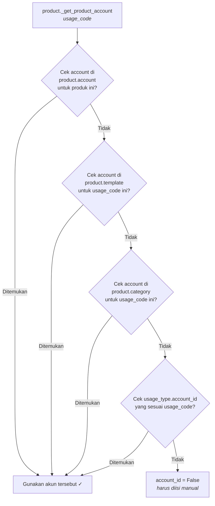

# Alur Resolusi Akun

Saat `usage_id` dan `product_id` sudah terisi pada baris transaksi, mixin memanggil:

```python
self.product_id._get_product_account(usage_code=self.usage_id.code)
```

Method ini menerapkan **hierarki resolusi 4 level** dari yang paling spesifik ke yang
paling umum (fallback).

---

## Hierarki Resolusi (Akun)



---

## Implementasi Kode

```python
def _get_product_account(self, usage_code, local_dict=False):
    self.ensure_one()

    # Level 1: Product-level override
    result = self._get_account(usage_code=usage_code)

    # Level 2: Product template level
    if not result:
        result = self.product_tmpl_id._get_account(
            usage_code=usage_code, local_dict=local_dict
        )

    # Level 3: Product category level
    if not result:
        result = self.categ_id._get_account(
            usage_code=usage_code, local_dict=local_dict
        )

    # Level 4: Fallback ke usage_type.account_id
    if not result:
        usage_types = self.env["product.usage_type"].search(
            [("code", "=", usage_code)]
        )
        if usage_types:
            result = usage_types[0]._get_account(local_dict=local_dict)

    return result
```

---

## Hierarki Resolusi (Pajak)

Logika yang sama diterapkan untuk pajak melalui `_get_product_tax`:

| Level | Sumber |
|---|---|
| 1 | `product.account` — tax override per produk & usage |
| 2 | `product.template` — tax di template produk |
| 3 | `product.category` — tax di kategori produk |
| 4 | `product.usage_type.tax_ids` — fallback di usage type |

---

## Ringkasan

| Level | Model | Spesifisitas |
|---|---|---|
| 1 | `product.account` | Tertinggi — override per produk |
| 2 | `product.template` | Berlaku untuk semua varian produk |
| 3 | `product.category` | Berlaku untuk semua produk dalam kategori |
| 4 | `product.usage_type` | Terendah — fallback global per usage |

!!! tip "Best Practice"
    Konfigurasi akun di **Level 4** (`usage_type.account_id`) sebagai default global,
    lalu override di level yang lebih spesifik hanya jika diperlukan.
