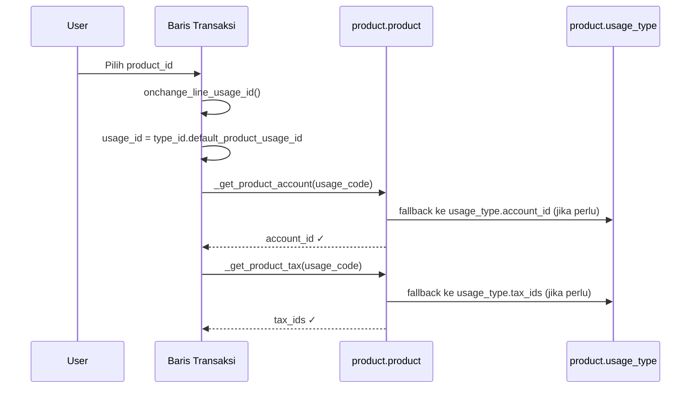

# Mixin Product Line Account

**Model:** `mixin.product_line_account`
**Modul:** `ssi_product_line_account_mixin`
**Inherit:** `mixin.product_line_price` → `mixin.product_line`

---

## Tujuan

`mixin.product_line_account` adalah **abstract mixin** yang digunakan oleh semua baris
transaksi expense SSI. Mixin ini menambahkan tiga field kunci ke baris transaksi:

- `usage_id` — konteks penggunaan produk (Product Usage Type)
- `account_id` — akun akuntansi yang ditentukan otomatis dari kombinasi produk + usage
- `analytic_account_id` — akun analitik opsional

---

## Hierarki Inheritance

```
mixin.product_line
  └── mixin.product_line_price       (currency, pricelist, price_unit, subtotal, dll.)
        └── mixin.product_line_account (usage_id, account_id, tax_ids, dll.)
              ├── hr.reimbursement_line
              ├── hr.cash_advance_line
              └── hr.cash_advance_settlement_line
```

---

## Fields yang Ditambahkan

```python
# Pajak
tax_ids = fields.Many2many(comodel_name="account.tax")

# Subtotal perhitungan pajak
price_subtotal = fields.Monetary(compute="_compute_total", store=True)
price_tax     = fields.Monetary(compute="_compute_total", store=True)
price_total   = fields.Monetary(compute="_compute_total", store=True)

# Usage Type — kunci utama untuk resolusi akun
allowed_usage_ids = fields.Many2many(
    comodel_name="product.usage_type",
    compute="_compute_allowed_usage_ids",
)
usage_id = fields.Many2one(
    comodel_name="product.usage_type",
    ondelete="restrict",
)

# Akun — diisi otomatis saat usage_id berubah
account_id = fields.Many2one(
    comodel_name="account.account",
    required=True,
    ondelete="restrict",
)
analytic_account_id = fields.Many2one(
    comodel_name="account.analytic.account",
    required=False,
    ondelete="restrict",
)
```

---

## Alur Kerja (Onchange)

### Langkah 1 — User memilih `product_id`

```python
@api.depends("product_id")
def _compute_allowed_usage_ids(self):
    # Mengambil semua product.usage_type yang valid untuk produk ini
    # melalui _get_usage_domain() (dapat di-override di subclass)
    Usage = self.env["product.usage_type"]
    for record in self:
        if record.product_id:
            criteria = record._get_usage_domain()
            record.allowed_usage_ids = Usage.search(criteria).ids
```

Di subclass (mis. `hr.cash_advance_line`), saat `product_id` berubah:

```python
@api.onchange("product_id")
def onchange_line_usage_id(self):
    self.usage_id = False
    if self.product_id:
        # Set usage_id default dari expense type
        self.usage_id = self.type_id.default_product_usage_id.id
```

### Langkah 2 — `usage_id` ditetapkan → `account_id` & `tax_ids` terisi otomatis

```python
@api.onchange("usage_id", "product_id")
def onchange_account_id(self):
    self.account_id = False
    if self.product_id and self.usage_id:
        self.account_id = self.product_id._get_product_account(
            usage_code=self.usage_id.code
        )

@api.onchange("usage_id", "product_id")
def onchange_tax_ids(self):
    self.tax_ids = False
    if self.product_id and self.usage_id:
        self.tax_ids = [
            (6, 0, self.product_id._get_product_tax(usage_code=self.usage_id.code))
        ]
```

---

## Diagram Alur Onchange


