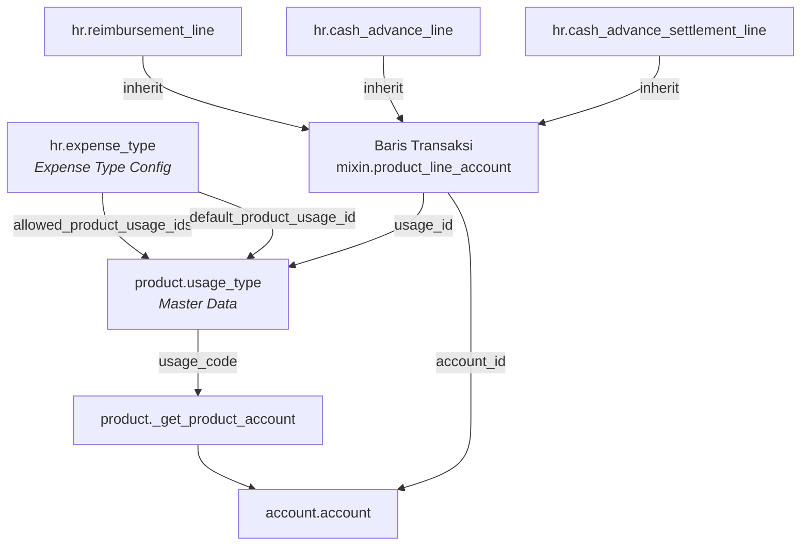

# SSI Product Usage Type — Tutorial

Selamat datang di dokumentasi **Product Usage Type** pada ekosistem modul HR Expense
SSI (PT. Simetri Sinergi Indonesia / OpenSynergy Indonesia) untuk Odoo 14.

---

## Apa yang Akan Dipelajari?

Dokumentasi ini menjelaskan bagaimana **`product.usage_type`** (Product Usage Type)
berfungsi sebagai jembatan antara **produk** dan **akun akuntansi** pada transaksi
pengeluaran karyawan, mencakup:

| Topik | Deskripsi |
|---|---|
| [Product Usage Type](concept/product-usage-type.md) | Model master data `product.usage_type` |
| [Mixin Product Line Account](concept/mixin-product-line-account.md) | Mixin yang mengintegrasikan Usage ke baris transaksi |
| [Alur Resolusi Akun](concept/account-resolution.md) | Hierarki pencarian akun berdasarkan usage code |
| [Reimbursement](use-cases/reimbursement.md) | Penerapan pada `hr.reimbursement` |
| [Cash Advance](use-cases/cash-advance.md) | Penerapan pada `hr.cash_advance` |
| [Cash Advance Settlement](use-cases/cash-advance-settlement.md) | Penerapan pada `hr.cash_advance_settlement` |

---

## Gambaran Umum Arsitektur

---

## Konsep Inti

**Product Usage Type** menjawab pertanyaan:

> _"Produk X digunakan untuk keperluan apa, sehingga harus dicatat ke akun mana?"_

Satu produk yang sama (misalnya "Tiket Pesawat") dapat diposting ke akun berbeda
bergantung pada **konteks penggunaannya**:

- Perjalanan dinas → akun **Biaya Perjalanan Dinas**
- Training → akun **Biaya Pelatihan**
- Proyek klien → akun **WIP Project**

Usage Type-lah yang membedakan konteks tersebut.
