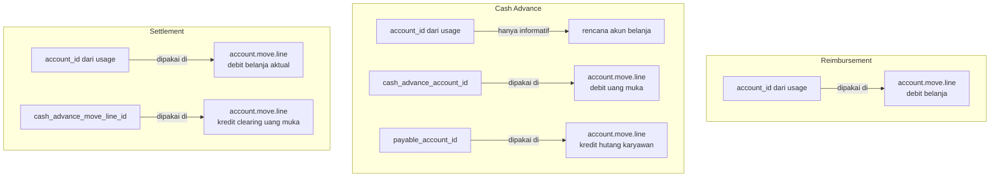
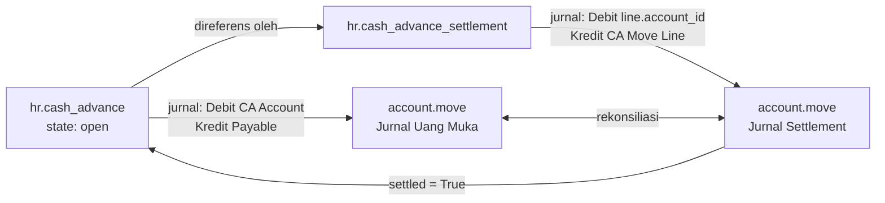

# Ringkasan Perbandingan

Halaman ini menyajikan perbandingan komprehensif penggunaan `product.usage_type`
di tiga objek transaksi.

---

## Perbandingan Header

| Aspek | `hr.reimbursement` | `hr.cash_advance` | `hr.cash_advance_settlement` |
|---|---|---|---|
| Modul | `ssi_hr_reimbursement` | `ssi_hr_cash_advance` | `ssi_hr_cash_advance` |
| Alur status | draft→confirm→open→done | draft→confirm→open→done | draft→confirm→done |
| Punya `type_id`? | ✅ | ✅ | ✅ |
| `allowed_product_usage_ids` | Via `type_id` | Via `type_id` | Via `type_id` |
| Akun di header | `account_id` (payable) | `payable_account_id` + `cash_advance_account_id` | Via `cash_advance_id` |
| Baris model | `hr.reimbursement_line` | `hr.cash_advance_line` | `hr.cash_advance_settlement_line` |

---

## Perbandingan Baris

| Aspek | `hr.reimbursement_line` | `hr.cash_advance_line` | `hr.cash_advance_settlement_line` |
|---|---|---|---|
| Inherit | `mixin.product_line_account` | `mixin.product_line_account` | `mixin.product_line_account` |
| Parent FK | `reimbursement_id` | `cash_advance_id` | `cash_advance_settlement_id` |
| `type_id` (related) | `reimbursement_id.type_id` | `cash_advance_id.type_id` | `cash_advance_settlement_id.type_id` |
| `usage_id` default dari | `type_id.default_product_usage_id` | `type_id.default_product_usage_id` | `type_id.default_product_usage_id` |
| `account_id` dipakai di jurnal | ✅ Ya | ❌ Hanya informatif | ✅ Ya |
| Field `date_expense` | ✅ | ✅ | ✅ |

---

## Perbandingan Fungsi Akun di Baris

---

## Alur Lengkap: Cash Advance → Settlement

---

## Perbandingan Semua Use Case

| Aspek | HR Expense (Reimburse/CA/Settlement) | Stock Move | Outsource Work |
|---|---|---|---|
| Modul | `ssi_hr_reimbursement` / `ssi_hr_cash_advance` | `ssi_stock_account` | `ssi_outsource_work` |
| Jumlah usage per record | 1 (`usage_id`) | 2 (`debit_usage_id` + `credit_usage_id`) | 1 (`usage_id`) |
| Konfigurasi usage di | `hr.expense_type` | `stock.picking.type` | `ir.model` |
| Metode seleksi | Default dari expense type | Manual / Python Code | Fixed / Python Code |
| Inherit mixin | `mixin.product_line_account` (di line) | \u2014 | `mixin.product_line_account` |
| Output jurnal | AML per baris dokumen | AML debit + kredit per move | AML di outstanding batch |
| `account_id` dipakai di jurnal | ✅ Ya (kecuali CA line) | ✅ Ya (debit & kredit) | ✅ Ya |

---

## Rangkuman Konfigurasi yang Diperlukan

Untuk menggunakan fitur ini dengan benar, pastikan konfigurasi berikut sudah ada:

1. **`product.usage_type`** — buat usage type dengan kode unik dan `account_id`
2. **Produk** — opsional: konfigurasi `product.account` untuk override akun per produk
3. **HR Expense** (`hr.expense_type`):
   - Set `allowed_product_usage_ids` → usage yang boleh dipilih
   - Set `default_product_usage_id` → usage yang otomatis terisi
4. **Stock Move** (`stock.picking.type`):
   - Set `debit_account_method` + `debit_usage_id` (atau `debit_account_code`)
   - Set `credit_account_method` + `credit_usage_id` (atau `credit_account_code`)
5. **Outsource Work** (`ir.model` dari dokumen induk):
   - Set `outsource_work_usage_selection_method`
   - Set `outsource_work_usage_ids` (Fixed) atau `outsource_work_usage_python_code` (Python)
6. **Transaksi** — pilih tipe/dokumen yang sudah dikonfigurasi, lalu input data
