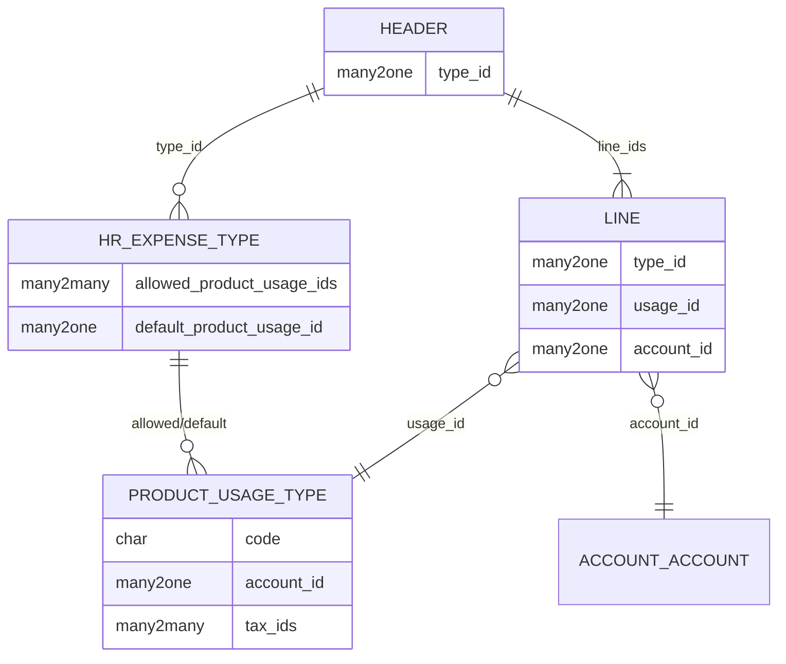

# Overview Penerapan

Bagian ini menjelaskan bagaimana `product.usage_type` diterapkan pada tiga objek utama
modul HR Expense SSI.

---

## Ringkasan Objek

| Header (Dokumen) | Baris (Line) | Mixin | Modul |
|---|---|---|---|
| `hr.reimbursement` | `hr.reimbursement_line` | `mixin.product_line_account` | `ssi_hr_reimbursement` |
| `hr.cash_advance` | `hr.cash_advance_line` | `mixin.product_line_account` | `ssi_hr_cash_advance` |
| `hr.cash_advance_settlement` | `hr.cash_advance_settlement_line` | `mixin.product_line_account` | `ssi_hr_cash_advance` |
| `stock.move` | _(dokumen tunggal, bukan line)_ | — | `ssi_stock_account` |
| `outsource_work` | _(dokumen tunggal, bukan line)_ | `mixin.product_line_account` | `ssi_outsource_work` |

---

## Pola Umum

Ketiga objek mengikuti **pola yang sama**:

1. **Header** menyimpan `type_id` (→ `hr.expense_type`) yang mengatur:
   - `allowed_product_usage_ids` — usage yang boleh dipakai
   - `default_product_usage_id` — usage default saat produk dipilih

2. **Baris (Line)** mewarisi `mixin.product_line_account`, menyimpan:
   - `type_id` (related dari header, read-only)
   - `usage_id` — diisi otomatis dari `type_id.default_product_usage_id`
   - `account_id` — diisi otomatis dari resolusi `product + usage_code`
   - `tax_ids` — diisi otomatis dari resolusi `product + usage_code`

3. Saat dokumen di-post/done, `account_id` dari baris digunakan untuk membuat
   **journal entry** (`account.move.line`).

!!! info "Variasi Pola"
    `stock.move` dan `outsource_work` mengikuti varian pola ini:

    - **`stock.move`** — menggunakan **dua** usage (`debit_usage_id` + `credit_usage_id`)
      yang dikonfigurasi di `stock.picking.type`, bukan di expense type.
    - **`outsource_work`** — menggunakan satu `usage_id` dari `mixin.product_line_account`,
      tetapi pembatasan usage dikonfigurasi di `ir.model` (bukan `hr.expense_type`).

---

## Diagram Relasi

