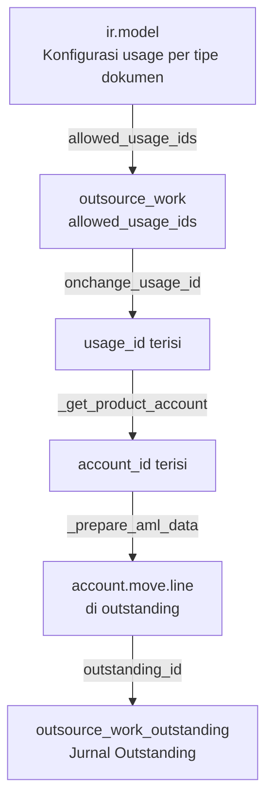
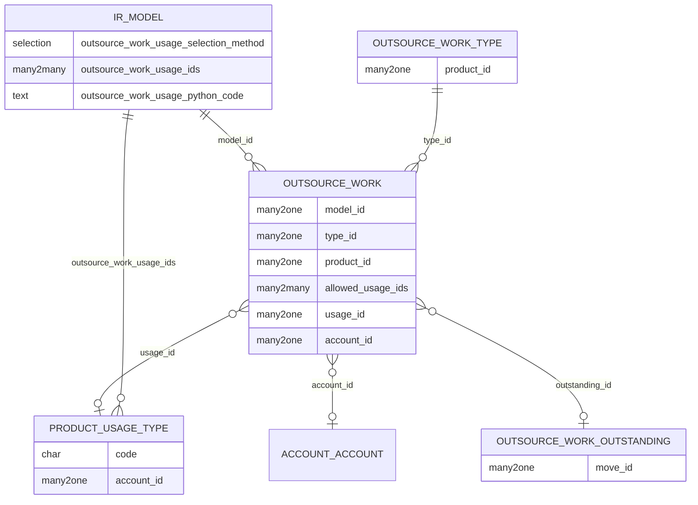

# Outsource Work — Penggunaan Usage Type

**Model:** `outsource_work`
**Modul:** `ssi_outsource_work`

---

## Konteks

`outsource_work` merepresentasikan **pencatatan kerja outsource** yang dikaitkan ke
suatu dokumen induk (misalnya: proyek, kontrak, atau pekerjaan tertentu) secara
dinamis via `ir.model` dan `work_object_id`. Model ini inherit
`mixin.product_line_account`, sehingga mengikuti pola resolusi akun berbasis
`usage_id` yang sama dengan modul HR Expense — tetapi dengan perbedaan penting pada
cara **pembatasan usage** yang tersedia.

---

## Pewarisan `mixin.product_line_account`

```python
class OutsourceWork(models.Model):
    _name = "outsource_work"
    _inherit = [
        "mixin.transaction_cancel",
        "mixin.transaction_done",
        "mixin.transaction_confirm",
        "mixin.product_line_account",   # ← resolusi usage → account
    ]
```

Dengan mewarisi `mixin.product_line_account`, `outsource_work` otomatis mendapatkan:

- Field `usage_id` (`product.usage_type`)
- Field `account_id` (`account.account`)
- Onchange `onchange_account_id` yang memanggil `_get_product_account`

---

## Konfigurasi Usage di `ir.model`

Berbeda dengan HR Expense yang mengonfigurasi usage di `hr.expense_type`, pada
`outsource_work` pembatasan usage dikonfigurasi di **model dokumen induk** (`ir.model`):

```python
# ir.model (field tambahan dari ssi_outsource_work)
outsource_work_usage_selection_method = Selection([
    ("fixed",  "Fixed"),
    ("python", "Python Code"),
])
outsource_work_usage_ids = Many2many("product.usage_type")   # jika method = fixed
outsource_work_usage_python_code = Text(...)                  # jika method = python
```

### Metode "Fixed"
Daftar usage dikunci ke `outsource_work_usage_ids` yang dikonfigurasi langsung di
record `ir.model` yang bersangkutan.

### Metode "Python Code"
Daftar usage ditentukan secara dinamis. Variabel yang tersedia:

```python
# Available variables:
env      # Odoo Environment
document # record dokumen induk (diambil via model_name + work_object_id)
result   # kembalikan: list ID product.usage_type
result = []
```

---

## Compute `allowed_usage_ids`

```python
@api.depends("model_id")
def _compute_allowed_usage_ids(self):
    Usage = self.env["product.usage_type"]
    for document in self:
        result = []
        if document.model_id:
            model = document.model_id
            if model.outsource_work_usage_selection_method == "fixed":
                if model.outsource_work_usage_ids:
                    result += model.outsource_work_usage_ids.ids
            elif model.outsource_work_usage_selection_method == "python":
                usage_ids = self._evaluate_worklog_usage(model)
                if usage_ids:
                    result = usage_ids
            if len(result) > 0:
                criteria = [("id", "in", result)]
                result = Usage.search(criteria).ids
        document.allowed_usage_ids = result
```

---

## Onchange: Pengisian `usage_id` Otomatis

Ketika `model_id` berubah atau `allowed_usage_ids` diperbarui, usage otomatis diisi
dengan usage pertama dari daftar yang diperbolehkan:

```python
@api.onchange("model_id", "allowed_usage_ids")
def onchange_usage_id(self):
    self.usage_id = False
    if self.allowed_usage_ids:
        usage_type_id = self.allowed_usage_ids._origin[0]
        self.usage_id = usage_type_id.id
```

!!! info
    Ini berbeda dengan pola HR Expense yang mengisi `usage_id` dari
    `type_id.default_product_usage_id` saat `product_id` berubah. Di
    `outsource_work`, pemicunya adalah perubahan `model_id` (tipe dokumen induk).

---

## Resolusi Akun dari Usage

Setelah `usage_id` terisi, `account_id` diisi melalui `onchange_account_id` milik
mixin:

```python
# mixin.product_line_account
@api.onchange("usage_id", "product_id")
def onchange_account_id(self):
    self.account_id = False
    if self.product_id and self.usage_id:
        self.account_id = self.product_id._get_product_account(
            usage_code=self.usage_id.code
        )
```

`product_id` di `outsource_work` adalah field `related` ke `type_id.product_id`:

```python
product_id = fields.Many2one(
    string="Product",
    comodel_name="product.product",
    related="type_id.product_id",
    store=True,
)
```

Hierarki resolusi mengikuti aturan standar 4 level
(lihat [Alur Resolusi Akun](../concept/account-resolution.md)).

---

## Penggunaan `account_id` di Journal Entry

`account_id` hasil resolusi dipakai langsung saat membuat `account.move.line` di
dalam outstanding:

```python
def _prepare_aml_data(self):
    self.ensure_one()
    outstanding = self.outstanding_id
    ...
    return {
        "move_id": outstanding.move_id.id,
        "product_id": self.product_id.id,
        "name": self.name,
        "account_id": self.account_id.id,   # ← hasil resolusi usage
        "debit": debit,
        "credit": credit,
        ...
    }
```

Jurnal ini dibuat saat `outsource_work` mendapatkan `outstanding_id` (record
`outsource_work_outstanding`).

---

## Alur Lengkap



---

## Perbedaan dengan Pola HR Expense

| Aspek | HR Expense (Reimburse/CA) | Outsource Work |
|---|---|---|
| Konfigurasi usage di | `hr.expense_type` | `ir.model` (tipe dokumen) |
| Field di header | `type_id` → `hr.expense_type` | `model_id` → `ir.model` |
| Pemicu onchange usage | `product_id` berubah | `model_id` / `allowed_usage_ids` berubah |
| Metode seleksi | Tidak ada metode Python | Fixed atau Python Code |
| Output jurnal | `account.move` per dokumen | `account.move.line` di outstanding batch |
| Mixin yang dipakai | `mixin.product_line_account` | `mixin.product_line_account` |

---

## Diagram Relasi


