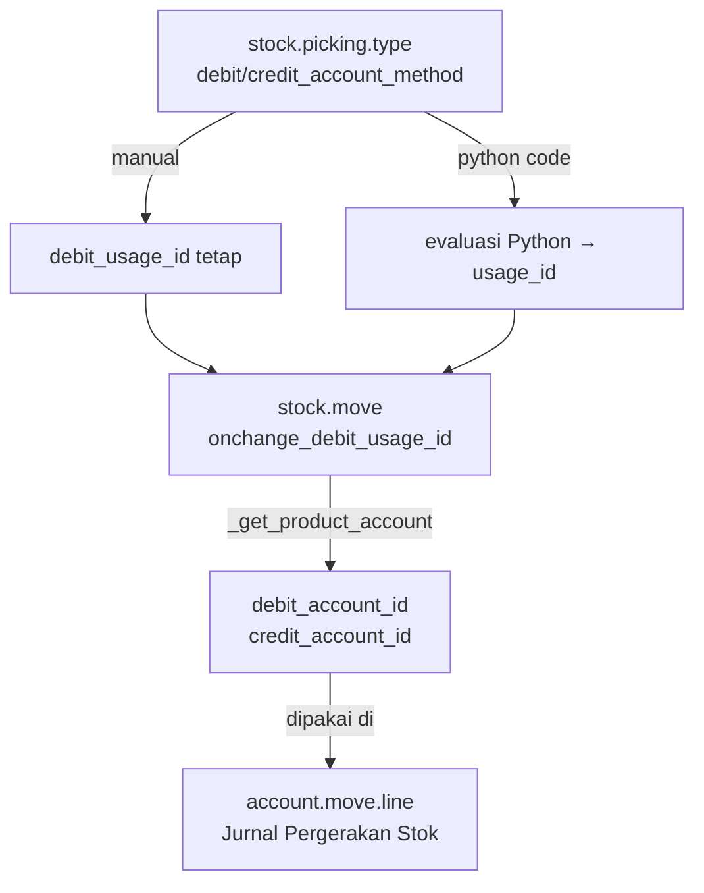
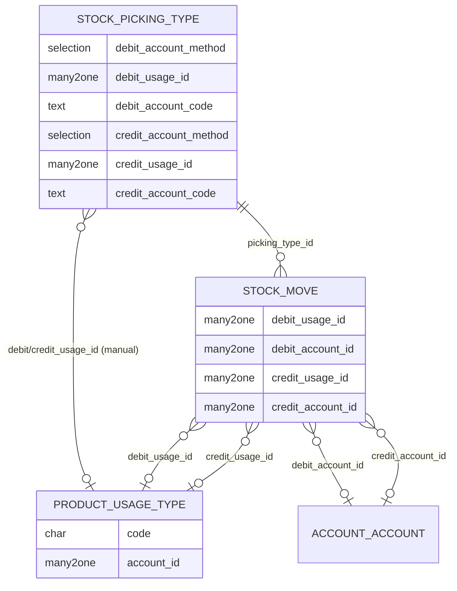

# Stock Move — Penggunaan Usage Type (Debit & Kredit)

**Model:** `stock.move` (extend dari `ssi_stock_account`)
**Modul:** `ssi_stock_account`

---

## Konteks

`stock.move` diperluas di modul `ssi_stock_account` untuk mendukung pencatatan
akuntansi pergerakan stok. Tidak seperti pola HR Expense yang menggunakan satu
`usage_id` per baris, `stock.move` menggunakan **dua** usage secara terpisah:

| Field | Tujuan |
|---|---|
| `debit_usage_id` | Menentukan akun **debit** pada jurnal pergerakan stok |
| `credit_usage_id` | Menentukan akun **kredit** pada jurnal pergerakan stok |

Ini mencerminkan karakteristik jurnal double-entry, di mana setiap pergerakan stok
menghasilkan minimal satu pasangan debit–kredit.

---

## Konfigurasi di `stock.picking.type`

Usage diatur di level **Tipe Operasi** (`stock.picking.type`), bukan di baris
transaksi secara langsung. Tersedia dua metode untuk masing-masing sisi:

```python
# stock.picking.type — field tambahan dari ssi_stock_account
debit_account_method  = Selection([("manual","Manual"),("code","Python Code")])
debit_usage_id        = Many2one("product.usage_type")   # jika method = manual
debit_account_code    = Text(...)                         # jika method = code

credit_account_method = Selection([("manual","Manual"),("code","Python Code")])
credit_usage_id       = Many2one("product.usage_type")   # jika method = manual
credit_account_code   = Text(...)                         # jika method = code
```

### Metode "Manual"
Usage dikunci ke nilai tetap (`debit_usage_id` / `credit_usage_id`) yang dikonfigurasi
di Tipe Operasi.

### Metode "Python Code"
Usage ditentukan secara dinamis melalui kode Python. Variabel yang tersedia:

```python
# Available variables:
env      # Odoo Environment
document # record stock.move yang sedang diproses
result   # kembalikan: ID product.usage_type, atau False
```

---

## Alur Pengisian `usage_id` dan `account_id` di Stock Move



### `onchange_debit_usage_id` / `onchange_credit_usage_id`

```python
# stock.move
@api.onchange("picking_type_id", "price_unit", "product_id",
              "picking_location_id", "picking_location_dest_id")
def onchange_debit_usage_id(self):
    self.debit_usage_id = False
    if self.picking_type_id and self.picking_type_id.debit_account_method:
        if self.picking_type_id.debit_account_method == "manual":
            self.debit_usage_id = self.picking_type_id.debit_usage_id
        elif self.picking_type_id.debit_account_method == "code":
            try:
                localdict = self._get_account_localdict()
                safe_eval(
                    self.picking_type_id.debit_account_code,
                    localdict, mode="exec", nocopy=True,
                )
                result = localdict["result"]
            except Exception:
                result = False
            self.debit_usage_id = result
```

Pola yang sama berlaku untuk `onchange_credit_usage_id`.

---

## Resolusi Akun dari Usage

Setelah `debit_usage_id` / `credit_usage_id` terisi, akun diambil dengan memanggil
`_get_product_account` milik produk:

```python
# stock.move
@api.onchange("debit_usage_id", "product_id")
def onchange_debit_account_id(self):
    self.debit_account_id = False
    if self.product_id and self.debit_usage_id:
        self.debit_account_id = self.product_id._get_product_account(
            usage_code=self.debit_usage_id.code
        )
```

Hierarki resolusi mengikuti aturan standar 4 level
(lihat [Alur Resolusi Akun](../concept/account-resolution.md)):

1. `product.product` → `account_id` spesifik produk + usage code
2. `product.template` → `account_id` template + usage code
3. `product.category` → `account_id` kategori + usage code
4. `product.usage_type` → `account_id` default di usage type itu sendiri

---

## Pembaruan Otomatis saat `_action_assign`

Untuk memastikan `account_id` selalu terisi meskipun pick dilakukan secara server-side,
ada pengecekan di `_action_assign`:

```python
def _action_assign(self):
    _super = super(StockMove, self)
    _super._action_assign()

    for record in self.sudo():
        if not record.debit_account_id:
            record.onchange_debit_usage_id()
            record.onchange_debit_account_id()

        if not record.credit_account_id:
            record.onchange_credit_usage_id()
            record.onchange_credit_account_id()
```

!!! note "Pemicu dari Lokasi Picking"
    `_compute_move_location` juga memanggil `onchange_debit_usage_id()` dan
    `onchange_credit_usage_id()` setiap kali `picking_id.location_id` atau
    `picking_id.location_dest_id` berubah. Ini memungkinkan Python Code di
    Tipe Operasi menggunakan lokasi asal/tujuan sebagai dasar pemilihan usage.

---

## Perbedaan dengan Pola HR Expense

| Aspek | HR Expense (Reimbursement/CA) | Stock Move |
|---|---|---|
| Jumlah usage per baris | 1 (`usage_id`) | 2 (`debit_usage_id` + `credit_usage_id`) |
| Konfigurasi usage di | `hr.expense_type` | `stock.picking.type` |
| Metode seleksi | Default dari expense type | Manual atau Python Code |
| Pemicu onchange | `product_id` + `type_id` | `picking_type_id` + lokasi + produk |
| Akun dipakai di | AML debit belanja | AML debit **dan** kredit jurnal stok |

---

## Diagram Relasi


